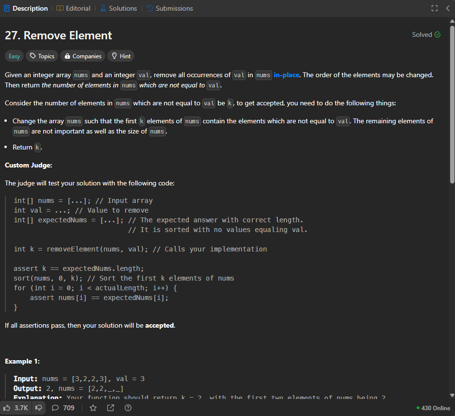

# Two Pointer

Duo to this problem is asking us to do it in-place, so we don't want to use extra space for this problem.

## Intuition

- I need two pointer, one is write pointer second is read pointer, writer would be the answer of this question
- Since it is going to check first k element, so I can just switch the k count of element into the target value

## Complexity

Since no extra space, all the action are gonna be done in place so space is O(1), and time is O(n) cause we're going to iterate through the whole array

- Time complexity: O(n)
- Space complexity: O(1)

```chsarp
public class Solution {
    public int RemoveElement(int[] nums, int val) {
        if(nums.Length == 0)
            return 0;

        var w=0;
        var r=0;
        while(r<nums.Length){
            if(nums[r]!=val){
                nums[w]=nums[r];
                w++;
            }
            r++;
        }
        return w;
    }
}
```
